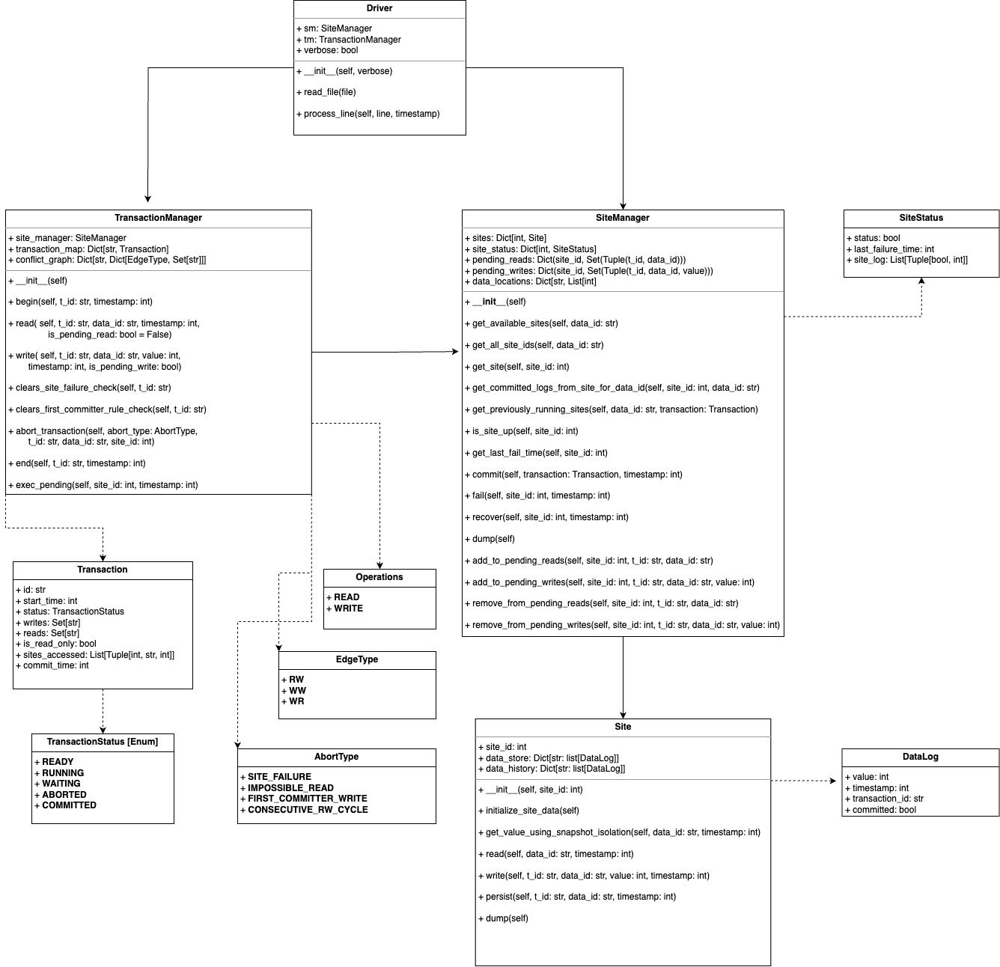

# Replicated Concurrency Control and Recovery

## Project Members

- Akash Kumar Shrivastva (as18464)
- Rishav Roy (rr4577)

## Project Description

This project tries to simulate Replicated Concurrency Control and Recovery in a Database System. The objective is to implement a distributed database system with concurreny control and fault tolerance through concurrent transaction processing, data replication and site failure simulations.

We leverage the following algorithms to achieve the objectives:

1. Serializable Snapshot Isolation Algorithm for Concurrency Control and validation at commit time.
2. Available Copies Algorithm for Fault Tolerance and Recover

## Running the project

For a concise output, run:

```python driver.py <input_file>```

For a more verbose output, run:

```python driver.py -v <input_file>```

For running the program over a directory of input files, run:

```./run.sh <input_directory> <output_directory>```

## Main Components

1. __Driver__: The distributed database system is built around four key components that work together to ensure reliable and consistent data operations. At the highest level, the Driver serves as the system's main controller and entry point, responsible for processing input commands and coordinating the overall flow of operations. It acts as an orchestrator, interpreting user instructions and directing them to appropriate components.


2. __Transaction Manager__: The Transaction Manager acts as the core processing engine for all transaction-related operations. It maintains complete control over transaction lifecycles, from initiation through to either commitment or abortion. This component implements concurrency control mechanisms through conflict detection and maintains transaction states.


3. __Site Manager__: Working closely with the Transaction Manager, the Site Manager operates as the central coordinator for all distributed operations across multiple database sites. It maintains a comprehensive view of the entire distributed system, tracking the health and availability of each site and managing data distribution. When sites fail or recover, the Site Manager handles the necessary adjustments, including managing pending operations and ensuring data consistency across replicated sites.


4. __Site__: At the lowest level, each Site represents an individual database node that handles actual data storage and operations. Sites implement multi-version concurrency control and manage local read and write operations on their stored data. Each site maintains detailed version histories of its data items and provides snapshot isolation capabilities to ensure consistent reads.

## UML Diagram

The following UML diagram is represents the components and data models used in the application:



