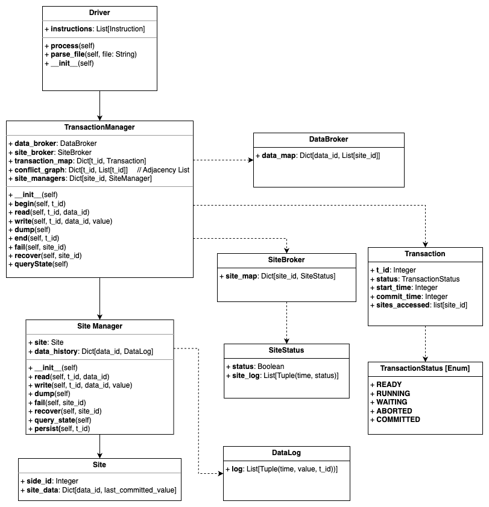

# Replicated Concurrency Control and Recovery

## Project Members

- Rishav Roy (rr4577)
- Akash Kumar Shrivastva (as18464)

## Project Description

This project tries to simulate Replicated Concurrency Control and Recovery in a Database System. The objective is to implement a distributed database system with concurreny control and fault tolerance through concurrent transaction processing, data replication and site failure simulations.

We leverage the following algorithms to achieve the objectives:

1. Serializable Snapshot Isolation Algorithm for Concurrency Control and validation at commit time.
2. Available Copies Algorithm for Fault Tolerance and Recover

## Main Components

1. __Driver__: The project will have a root driver program to parse the input file comprising of transaction operations. The driver initializes the other components - the *Transaction Manager (TM)* and *10 Site Managers (SM)*. The parsed instructions are then passed into the Transaction Manager.

2. __Transaction Manager__: Transaction Manager will be responsible for maintaining the Data Broker (a data structure to store data replication info) and the Site Broker (a data structure to store site health information) and implementing the Available Copies algorithm between the 10 site managers

3. __Site Manager__: 10 Data Managers managing operations for every site.

4. __Site__: Each Site Manager manages a single __Site__ will store information about the data items stored in site. This includes *before images* of a data-item before a transaction commits and the *after images* of a data-item after commit. This will allow the site to maintain correct status if a Transaction aborts.

## UML Diagram

The following UML diagram is represents the components and data models used in the application:




## CLASSES - LOGICAL DESCRIPTION 

```python
class Driver:
    """
    The Driver class is responsible for managing the flow of instructions within the system. 
    It takes a list of Instruction objects and processes them sequentially. The class provides 
    methods to parse a file containing instructions and convert them into executable commands.

    Attributes:
        instructions (List[Instruction]): A list of Instruction objects to be processed.

    Methods:
        process(): Executes each instruction in the list.
        parse_file(file: str): Reads and parses a file containing instructions, 
            converting them into Instruction objects.
        __init__(): Initializes the Driver class and prepares it to accept and process instructions.
    """
    
    def __init__(self):
        """Initializes the Driver class and prepares it to accept and process instructions."""
        pass
    
    def process(self):
        """Executes the  instruction in the list."""
        pass
    
    def parse_file(self, file: str):
        """
        Reads and parses a file containing instructions, converting them into Instruction objects.

        Args:
            file (str): The path to the file containing instructions.
        """
        pass
```

```python

class TransactionManager:
    """
    The TransactionManager class coordinates transactions across multiple sites. 
    It tracks active transactions, manages conflicts, and interacts with DataBroker and 
    SiteBroker to handle data access and transaction control.

    Attributes:
        data_broker (DataBroker): Manages the sites at which every data_id is replicated
        site_broker (SiteBroker): Maintains the status of each site_id
        transaction_map (Dict[int, Transaction]): A dictionary mapping transaction IDs to 
            Transaction objects.
        conflict_graph (Dict[int, List[int]]): Maintains an adjacency list representing transaction conflicts.
        site_managers (Dict[int, SiteManager]): A dictionary mapping site IDs to SiteManager instances.

    Methods:
        __init__(): Initializes the TransactionManager class.
        begin(t_id: int): Initiates a new transaction with the specified transaction ID.
        read(t_id: int, data_id: int): Processes a read request for a specific transaction and data item.
        write(t_id: int, data_id: int, value: int): Processes a write request for a specific transaction 
            and data item with the given value.
        dump(): Outputs the current state of all data managed by the system.
        end(t_id: int): Ends a specified transaction, committing or aborting based on conditions.
        fail(site_id: int): Handles failure events for a specific site, updating the transaction state.
        recover(site_id: int): Recovers a specified site from a failure state.
        queryState(): Provides the current state of the transactions and sites for debugging purpose.
    """
    
    def __init__(self):
        """Initializes the TransactionManager class.
        It will initialize the data_broker with the site_broker.
        It will also initiate a request to all SiteManager instances to write a default value for data items.
        
        """
        pass
    
    def begin(self, t_id: int):
        """
        Initiates a new transaction with the specified transaction ID.

        Args:
            t_id (int): The transaction ID.
        """
        pass
    
    def read(self, t_id: int, data_id: int):
        """
        Processes a read request for a specific transaction and data item.
        It checks the data_broker for the list of site_id the data item is replicated at.
        It will then goto the site_broker to check the status of replica sites and try to initiate a read using a specific SiteManager using Available Copies algorithm.

        Args:
            t_id (int): The transaction ID.
            data_id (int): The data item ID.
        """
        pass
    
    def write(self, t_id: int, data_id: int, value: int):
        """
        Processes a write request for a specific transaction and data item with the given value.
        It checks the data_broker for the list of site_id the data item is replicated at.
        It will then goto the site_broker to check the status of replica sites and try to initiate writes for all site managers containing the data item using Available Copies algorithm.
        

        Args:
            t_id (int): The transaction ID.
            data_id (int): The data item ID.
            value (int): The value to write.
        """
        pass
    
    def dump(self):
        """Outputs the current state of all data managed by the system."""
        pass
    
    def end(self, t_id: int):
        """
        It will perform the following checks using Serializable Snapshot Algorithm:
        
        a.  Ti will successfully commit only if no other concurrent transaction 
            Tk has already committed writes to data items where Ti has written
            versions that it intends to commit.
            
        b. It will check the conflict graph for consecutuve RW edges

        Using the above condictions it will decide whether to commit or abort a transaction.
        On commit, it will initiate the site managers to persist the latest value of the data item written by t_id using data_history.
        On abortion, the site managers do not get the instruction to persist the value of data item. 
    
        Args:
            t_id (int): The transaction ID.
        """
        pass
    
    def fail(self, site_id: int):
        """
        This method handles failure events for a specific site.
        It will update the SiteStatus.status of site_id to False using the site_broker.
        It will also add a log for this failure in SiteStatus.site_log.

        Args:
            site_id (int): The site ID.
        """
        pass
    
    def recover(self, site_id: int):
        """
        This method recovers a specified site from a failure state.
        It will update the SiteStatus.status of site_id to True using the site_broker.
        It will also add a log for this recovery in SiteStatus.site_log.

        Args:
            site_id (int): The site ID.
        """
        pass
    
    def queryState(self):
        """Provides the current state of the transactions and sites."""
        pass

```python

class SiteManager(ToUpdate):
    """
    The SiteManager class manages data at an individual site. It oversees data access, 
    failure recovery, and logging operations. Each SiteManager instance is linked to a Site 
    object and maintains a history of data values, ensuring local data consistency.

    Attributes:
        site (Site): A reference to the Site object that the SiteManager manages.
        data_history (Dict[int, DataLog]): A dictionary that maintains a log of changes 
            for each data item managed by the site.

    Methods:
        __init__(): Initializes the SiteManager, setting up the site and data history.
        read(t_id: int, data_id: int): Reads the value of a specified data item for a transaction.
        write(t_id: int, data_id: int, value: int): Writes a new value to a specified data item 
            for a transaction.
        dump(): Outputs the current state of data items at the site.
        fail(site_id: int): Simulates a failure for the site, affecting data availability.
        recover(site_id: int): Recovers the site from a failure state.
        query_state(): Provides the current state and status of the site.
    """
    
    def __init__(self):
        """Initializes the SiteManager, setting up the site and data history for tracking data changes."""
        pass
    
    def read(self, t_id: int, data_id: int):
        """
        Reads the value of a specified data item for a transaction.

        Args:
            t_id (int): The transaction ID.
            data_id (int): The data item ID.
        """
        pass
    
    def write(self, t_id: int, data_id: int, value: int):
        """
        Writes a new value to a specified data item for a transaction.

        Args:
            t_id (int): The transaction ID.
            data_id (int): The data item ID.
            value (int): The value to write.
        """
        pass
    
    def dump(self):
        """Outputs the current state of data items at the site."""
        pass
    
    def fail(self, site_id: int):
        """
        Simulates a failure for the site, affecting data availability.

        Args:
            site_id (int): The site ID.
        """
        pass
    
    def recover(self, site_id: int):
        """
        Recovers the site from a failure state, restoring data availability.

        Args:
            site_id (int): The site ID.
        """
        pass
    
    def query_state(self):
        """Provides the current state and status of the site."""
        pass

```
